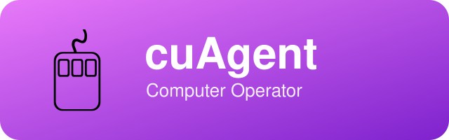

  

# cuAgent

> 🖱️ **cuAgent** (cu = computer-use) — computer operator. It operates your computer's GUI for you through computer-use: reading the screen, clicking, typing, and dragging — so manual, repetitive work is handled by an agent.

[简体中文](README_cn.md)

cuAgent is a dedicated computer-operation agent: it connects to native GUI automation through the [open-computer-use](https://github.com/QwenLM/open-computer-use) MCP — reading app screenshots and accessibility trees, performing real interface actions like clicks, typing, and drags. You describe the goal; cuAgent does the interface work.

---

## What it can do

| Tool | Purpose |
|---|---|
| `list_apps` | List apps on this computer (running + recently used) |
| `get_app_state` | Capture a screenshot + accessibility tree of the app's key window |
| `click` / `drag` / `scroll` | Click / drag / scroll |
| `type_text` / `press_key` | Type text / press keys and shortcuts |
| `set_value` / `perform_secondary_action` | Set a control's value / invoke a secondary accessibility action |

---

## How to use it

1. Start an MCP-capable agent client (pi / Claude Code) in the cuAgent project directory;
2. On first use, **approve this project's MCP server** (project trust + a one-time approval — a deliberate safety gate);
3. On macOS, grant **Accessibility** and **Screen Recording** permissions in System Settings → Privacy & Security;
4. Just tell the agent what to operate (which app, what to do, expected result).

Configuration lives in the project-root [`.mcp.json`](.mcp.json): `open-computer-use` is launched by `npx` against a pinned `@qwen-code/open-computer-use` version — **enabled only inside this project, never installed globally**. The project's default model is pinned in `.pi/settings.json` (`dashscope/qwen3.8-max`, picked for its image input so screenshots work) — change it freely.

---

## Safety boundaries

- **Confirm destructive / externally visible actions first**: sending, deleting, purchasing, publishing — ask the user before acting;
- **Stay out of the way**: operate apps in the background, never steal the foreground window, never overwrite the clipboard without being asked;
- **Scoped by design**: the computer-use capability exists only in this project; no other project or global config enables it.

---

## License & Attribution

Copyright (c) 2026 All Contributors. Licensed under the [MIT License](LICENSE.md).

**Attribution:** If you derive from or redistribute this project, please retain the copyright notice and license file, and credit the source: [cuAgent](https://github.com/xhqing/cuAgent).
